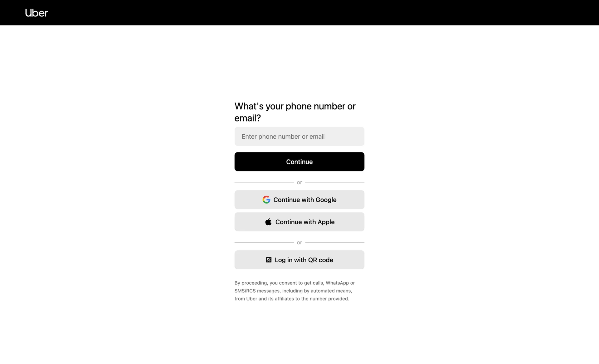

# Uber Clone

## Índice
- [Sobre o Projeto](#sobre-o-projeto)
- [Tecnologias](#tecnologias)
- [Requisitos Funcionais](#requisitos-funcionais)
- [Requisitos Não Funcionais](#requisitos-nao-funcionais)
- [Regras de Negócio](#regras-de-negocio)
- [Instalação](#instalacao)
- [Endpoints](#endpoints)

---

## Sobre o Projeto

Descrição breve do projeto, o que ele faz e o problema que resolve.

---

## 🚀 Tecnologias

- Node.js
- TypeScript
- React Native
- Fastify
- Prisma
- PostgreSQL

---

## ✅ Requisitos Funcionais

- Cadastro e login de usuários via email ou google
- Visualização e atualização do perfil de usuário
- Logout da conta

---

## 🚫 Requisitos Não Funcionais

- Backend Typescript, Nodejs, Prisma ORM
- Banco de dados Postgrees
- Docker
- Segurança com autenticação via JWT e HTTPS
- Testes E2E e units
- Arquitetura SOLID
- Validação com react-hook-form e zod

---

## 📜 Regras de Negócio

- Os campos devem ser validados

---

## 📦 Instalação

```bash
git clone https://github.com/seu-usuario/nome-do-projeto.git
cd nome-do-projeto
npm install
npm run dev
```

## Endpoints
- Endpoints de Candidato

| Método   | Endpoint                     | Descrição                                         |
|----------|------------------------------|---------------------------------------------------|
| `POST`   | `/candidate/register`        | Cria um novo candidato                            |
| `POST`   | `/candidate/auth`            | Autentica um candidato                            |
| `PUT`    | `/candidate/update`          | Atualiza um candidato                             |
| `GET`    | `/candidate/profile`         | Retorna os dados do candidato autenticado         |
| `GET`    | `/candidate/jobs?filter`     | Lista todas as vagas que correspondem a um filtro |
| `POST`   | `/candidate/application`     | Realiza uma candidatura em uma nova vaga          |
| `GET`    | `/candidate/my-applications` | Lista todas as candidaturas do candidato          |

- Endpoints de Empresa

| Método   | Endpoint                     | Descrição                                         |
|----------|------------------------------|---------------------------------------------------|
| `POST`   | `/company/register`          | Cria uma nova empresa                             |
| `POST`   | `/company/auth`              | Autentica uma empresa                             |
| `PUT`    | `/company/update`            | Atualiza uma empresa                              |
| `GET`    | `/company/profile`           | Retorna os dados da empresa autenticada           |
| `POST`   | `/company/add-job`           | Cria uma nova vaga                                |
| `PUT`    | `/company/update-job`        | Atualiza uma vaga                                 |
| `PUT`    | `/company/close-job/{id}`    | Encerra uma vaga e marca o status como `CLOSED`   |
| `GET`    | `/company/my-jobs`           | Lista todas as vagas criadas pela empresa         |